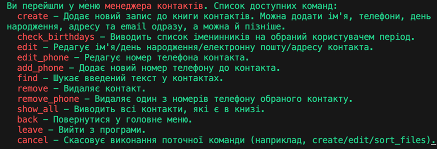
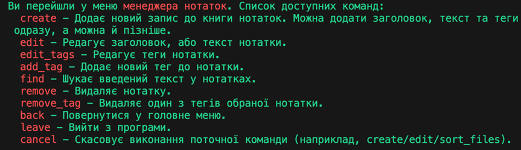
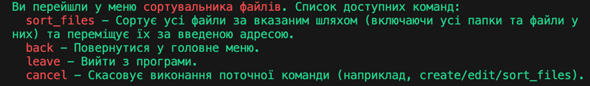

“Персональний помічник”ʼ 
(CC-assistant v0.0.1)

Встановлення

Щоб встановити програму потрібно відкрити теку CodeCrafters_assistant (якщо ви не змінювали назву після завантаження) або теку, де знаходиться установчий пакет (файл setup.py), запустити термінал у цій теці та у командному рядку ввести “ pip install . ” (без лапок)

Після завершення встановлення можна перевірити наявність встановленого пакету (CC-assistant) у списку.
Для цього ввести команду “ pip list” (без лапок)

Package         Version
--------------- -------
build           1.0.3
CC-assistant    0.0.1
pip             23.3.2
prompt          0.4.1
prompt-toolkit  3.0.43

 
Інструкція користувача для Персонального Помічника

Запуск бота

1.	В командному рядку ввести команду  start_assistant
2.	Оберіть бажану мову введення (0 - English, 1 - Українська).
3.	Оберіть функціонал за допомогою введення в консолі:
'0' - Менеджер контактів,
'1' - Менеджер нотаток,
'2' - Сортування файлів.

4.	Для виходу з програми напишіть команду “leave”

Менеджер контактів:

Для роботи з менеджером контактів доступні наступні команди:
 
почніть вводити в командній строці команду і функція автозаповння запропонує обрати доступну з команд

Після обрання команди слідкуйте за підказками Помічника для коректного заповнення, збереження та відображення  введеної інформації

Менеджер нотаток:

Для роботи з менеджером нотатків доступні наступні команди:
 
почніть вводити в командній строці команду і функція автозаповння запропонує обрати доступну з команд

Після обрання команди слідкуйте за підказками Помічника для коректного заповнення, збереження та відображення  введеної інформації

Сортування файлів:

 
 
почніть вводити в командній строці команду і функція автозаповння запропонує обрати доступну з команд

Після обрання команди слідкуйте за підказками Помічника для обрання відповідних тек для сортування та збереження відсортованих файлів

Сортування файлів відбуваеться за наступними типами даних: 
1. images - JPEG, JPG, PNG, SVG,
2. video - AVI, MP4, MOV, MKV, 
3. documents - DOC, DOCX, TXT, PDF, XLSX, PPTX,
4. audio - MP3, OGG, WAV, AMR,
5. archives - ZIP, GZ, TAR, RAR, 7Z
